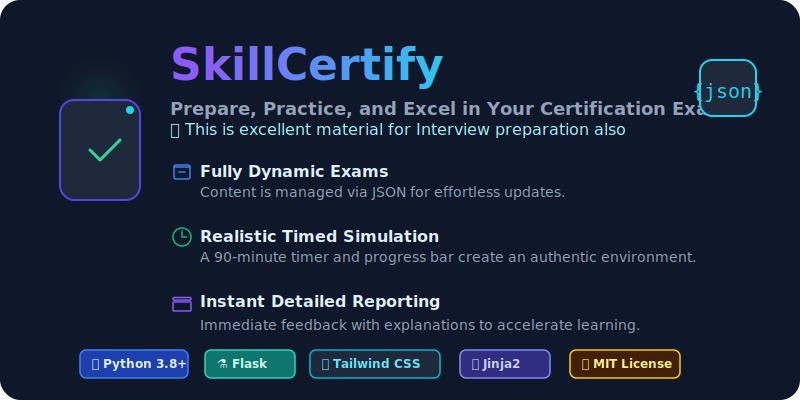
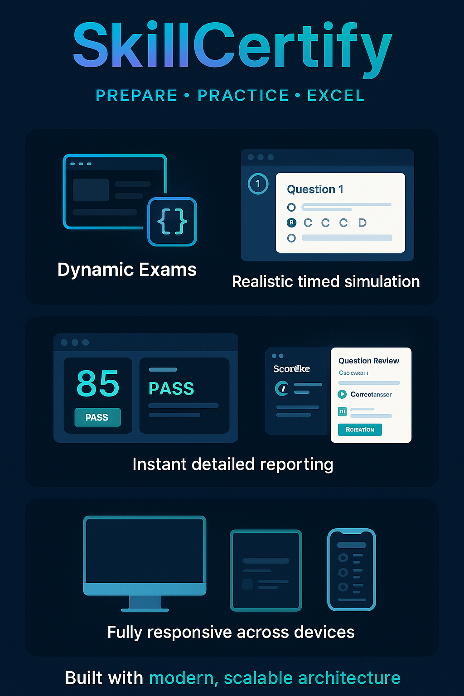

<p align="center">
    
</p>

<h3 align="center">Master Your Tech Skills. Ace Your Certifications.</h3>

<p align="center">

  <!-- Python Version -->
  <a href="https://www.python.org/">
    
  </a>

  <!-- Jinja2 Badge -->
  <a href="https://jinja.palletsprojects.com/">
    
  </a>

  <!-- Tailwind CSS Badge -->
  <a href="https://tailwindcss.com/">
    
  </a>

  <!-- Flask Badge -->
  <a href="https://flask.palletsprojects.com/">
    
  </a>

  <!-- License -->
  <a href="https://github.com/your-username/certiforge/blob/main/LICENSE">
    
  </a>

  <!-- Status -->
  <a href="#">
    
  </a>

</p>


<!-- 
<p align="center"> 
  
</p> 
-->


---
## 📚 Table of Contents

- [📌 Overview](#Overview)
- [🚀 Beyond Certification: Your Interview Prep Powerhouse](#-beyond-certification-your-interview-prep-powerhouse)
- [✨ Key Features](#-key-features)
- [🛠️ Technology Stack](#️-technology-stack)
- [⚙️ Local Setup & Installation](#️-local-setup--installation)
  - [1. Prerequisites](#1-prerequisites)
  - [2. Clone the Repository](#2-clone-the-repository)
  - [3. Set Up the Virtual Environment](#3-set-up-the-virtual-environment)
  - [4. Install Dependencies](#4-install-dependencies)
  - [5. Configure the Environment](#5-configure-the-environment)
  - [6. Run the Application](#6-run-the-application)
- [📝 How to Add New Exams](#-how-to-add-new-exams)
- [🏗️ Project Architecture](#️-project-architecture)
- [📜 License](#-license)

---
## 🧠 Overview

**SkillCertify** is more than just a quiz platform; it's a comprehensive training ground designed to bridge the gap between theoretical knowledge and certified expertise. Built with a clean, modern, and highly performant tech stack, it provides a seamless and realistic exam simulation environment to help developers and practitioners achieve their career goals.

---

### 🚀 Beyond Certification: Your Interview Prep Powerhouse

Technical interviews aren't just about knowing the answer; they're about demonstrating deep understanding under pressure. SkillCertify is the perfect tool to sharpen your edge.

*   **Solidify Core Concepts:** By tackling a wide range of questions, you reinforce foundational knowledge and uncover areas for improvement.
*   **Practice Under Pressure:** The timed environment simulates the stress of a real interview, training you to think clearly and perform when it counts.
*   **Articulate Complex Topics:** Reviewing detailed explanations helps you master the "why" behind the "what," enabling you to articulate your reasoning with confidence—a key trait that interviewers look for.

---

### ✨ Key Features

*   🎨 **Adaptive Light/Dark Theme:** A beautiful, persistent theme toggle for optimal user comfort, day or night.
*   🗂️ **Effortless Content Management:** The entire platform is driven by a JSON manifest. Add new exam topics, question sets, and icons with **zero code changes**, making the platform incredibly easy to maintain and expand.
*   ⏱️ **Realistic Timed Exams:** A 90-minute countdown timer and progress bar create an authentic, high-stakes practice environment.
*   ⚡ **Blazing-Fast SPA Interface:** The exam interface operates as a Single-Page Application, ensuring a smooth, uninterrupted experience with no page reloads between questions.
*   📊 **Insightful Performance Reports:** After each exam, users receive an instant score, a clear pass/fail status, and a detailed question-by-question report with correct answers and explanations presented in a clean, accessible modal.
*   📱 **Fully Responsive Design:** A flawless and intuitive experience across desktop, tablet, and mobile devices.
*   🧩 **Professional & Scalable Backend:** Built with modern Flask best practices (Blueprints, Application Factory) for a clean, maintainable, and scalable foundation.

---

### 🛠️ Technology Stack

| 🧱 Layer        | 🚀 Technologies                         |
|--------------|----------------------------------------|
| 🧠 **Backend**   | 🐍 Python, 🍶 Flask                        |
| 🖥️ **Frontend** | 🔤 HTML5, 🎨 Tailwind CSS, 🟨 Vanilla JS |
| 🧾 **Templates** | ✨ Jinja2                              |
| 📂 **Data Format**      | 📄 JSON                                  |

---

### ⚙️ Local Setup & Installation

Follow these steps to get SkillCertify running on your local machine.

#### 1. Prerequisites

*   Python 3.8+
*   `pip` and `venv` (standard with modern Python installations)

#### 2. Clone the Repository

```bash
git clone https://github.com/your-username/SkillCertify.git
cd SkillCertify
```

#### 3. Set Up the Virtual Environment

Using a virtual environment is crucial for managing project dependencies cleanly.

*   **On macOS/Linux:**
    ```bash
    python3 -m venv venv
    source venv/bin/activate
    ```
*   **On Windows:**
    ```bash
    python -m venv venv
    .\venv\Scripts\activate
    ```

#### 4. Install Dependencies

Install all required Python packages from the `requirements.txt` file.

```bash
pip install -r requirements.txt
```

#### 5. Configure the Environment

Create a `.env` file in the project's root directory. This file stores your application's secret key.

```bash
# For macOS/Linux:
cp .env.example .env

# For Windows:
copy .env.example .env
```
> **Security Note:** The `.env` file contains the `SECRET_KEY`. While a default is provided, you should generate a new, secure key for any production-like environment.

#### 6. Run the Application

Use the Flask Command-Line Interface to run the development server.

```python
python run
```

The application will now be running at `http://localhost:5000`.

---

### 📝 How to Add New Exams

The platform's content is 100% data-driven. Here’s how to add a new exam topic:

**1. Create the Question File:**
*   Add a new `.json` file to the `data/` directory (e.g., `data/python_basics.json`).
*   Structure it with an `"exam_sets"` array, following the format of the existing files.

**2. Add the Topic Icon:**
*   Create or find a suitable `.svg` icon for your new topic.
*   Place it inside the `q_bank_app/static/icons/svg/` directory (e.g., `python.svg`).

**3. Update the Central Manifest:**
*   Open the main manifest file: `data/topics_manifest.json`.
*   Add a new JSON object to the array that describes your new topic.

> **Example: Adding a Python topic to `topics_manifest.json`**
> ```json
> {
>   "topic_id": "python",
>   "filename": "python_basics.json",
>   "title": "Python Basics",
>   "description": "Test your knowledge of Python fundamentals.",
>   "svgfilename": "python.svg"
> }
> ```

**4. Restart the Server:**
*   Restart your Flask server. The new topic will appear on the home page automatically.

---

### 🏗️ Project Architecture

The project follows a standard Flask application structure for scalability and separation of concerns.

```
📁 SkillCertify/
├── 🧠 core_config/                     # App-wide configuration & logging setup
│   ├── 🗂️ logging/                     # Logging YAMLs for each environment
│   │   ├── 📝 logging_dev.yml
│   │   ├── 🛡️ logging_prod.yml
│   │   ├── 🧪 logging_test.yml
│   ├── 📦 __init__.py                 # Makes Config and LoggerUtility importable
│   ├── ⚙️ config.py                   # Loads env variables, constants, directory paths
│   └── 🧾 logger_util.py              # Initializes structured logging
|
├── 📂 data/                           # Question bank source files
│   ├── 🗃️ topics_manifest.json        # JSON index of all topics
│   └── 📄 *.json                      # Topic-specific exam data files (e.g., ai_basics.json)
|
├── 🖼️ img/                            # Static images (banners, headers, diagrams)
|
├── 🚀 skillcertify_web_app/           # Flask application and runtime logic
│   ├── 📦 __init__.py                 # App factory access point and global preload
│   ├── 🔄 data_loader/                # Loads question sets into Q_BANK at startup
│   │   ├── 📦 __init__.py
│   │   └── 📂 question_bank_loader.py # Parses exam sets and formats into memory
│   ├── 🎨 static/                     # Frontend assets (JS, CSS, SVGs)
│   │   ├── 🧵 css/main.css            # Tailwind output or custom styles
│   │   ├── ⚙️ js/exam.js              # Client-side quiz logic
│   │   └── 🖍️ icons/svg/              # Reusable scalable vector UI assets
│   ├── 🧱 templates/                  # Jinja2 view templates (HTML)
│   │   ├── 🧩 base.html               # Primary layout template (includes header/footer)
│   │   ├── 🪄 components/             # UI partials (used in many views)
│   │   │   ├── ⚙️ _macros.html        # Helper macros for templating logic
│   │   │   ├── 🔻 footer.html
│   │   │   ├── 🔺 header.html
│   │   │   └── 🪟 modal.html          # Generic dialog overlay
│   │   ├── 🚨 errors/                 # Custom error screens
│   │   │   └── 🚫 404.html            # Not Found error view
│   │   ├── 🔣 macros/                 # Shared macro utilities
│   │   │   └── 🧮 ui_macros.html      # UI buttons, looping widgets, etc.
│   │   └── 🗂️ pages/                  # Full-screen pages
│   │       ├── 🧪 exam.html           # Quiz UI and dynamic exam rendering
│   │       └── 🏠 index.html          # Homepage with available topics
│   └── 🧩 web_app/                    # Blueprint and route logic
│       ├── 📦 __init__.py             # Blueprint registration for routes
│       ├── 🌐 routes.py               # Route handlers for home, exam, fallback
│       └── 🏗️ web_app.py              # App factory method and lifecycle glue
|
├── 🔐 .env                            # Environment variables for Flask & app config
├── 📜 requirements.txt                # Python dependency lockfile
├── 🏁 run.py                          # Startup CLI + logging bootstrap
└── 📘 README.md                       # Project overview and setup instructions
```

---

### 📜 License

This project is licensed under the MIT License. See the `LICENSE` file for details.
